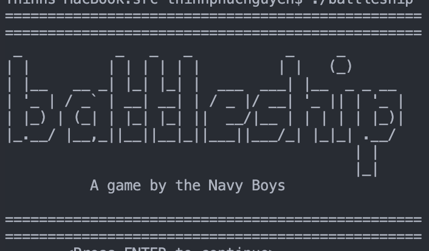

# Battleship Game (C++)

A simple terminal-based Battleship game written in C++. You choose a difficulty level and fire at hidden enemy ships by entering coordinates like `A5`. The game tracks hits, misses, ammo, and previous shots.

---

## Features
- Three difficulty levels  
- Random ship placement  
- Tracks ammo, hits, and previous shots  
- ASCII terminal board  
- Basic OOP design (Game, Board, Ship classes)

---

## Build Instructions

Compile all source files:

g++ -std=c++17 main.cpp battleshipgame.cpp ship.cpp board.cpp -o battleship

(Add any additional .cpp files your project uses.)

---

## Run the Game

./battleship

---

## How to Play
1. Choose a difficulty level (1–3).  
2. Enter coordinates (letter first, number second), e.g. `A5`, `C7`, `h3`.  
3. The board updates with hits, misses, and ammo count.  
4. Win by hitting all ship segments.  
5. Lose when you run out of ammo.  
6. Replay option at the end.

---

## Notes
- Coordinates must be entered as Letter + Number.  
- Ships are randomly placed each round.  
- Runs entirely in the terminal with no external libraries.
